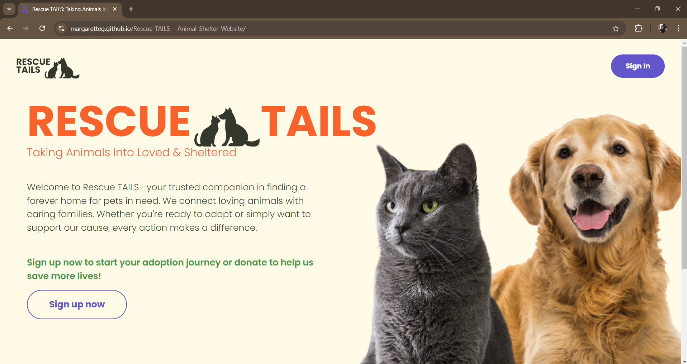
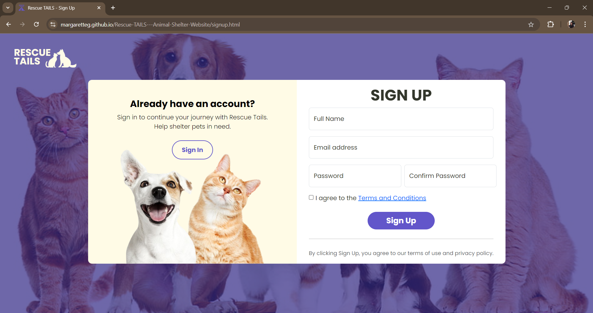
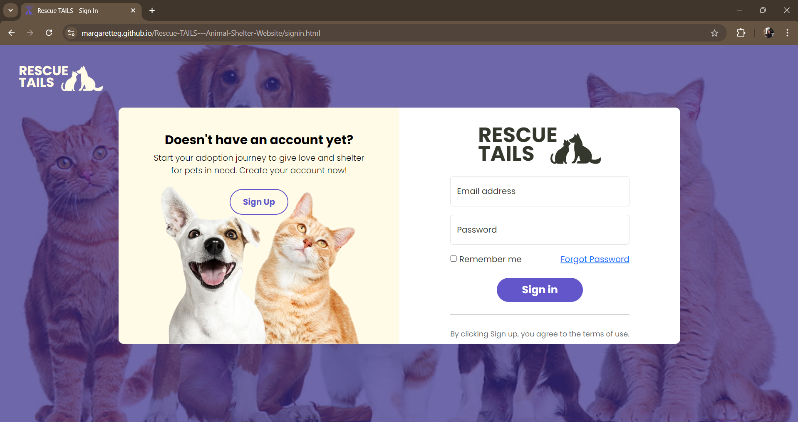
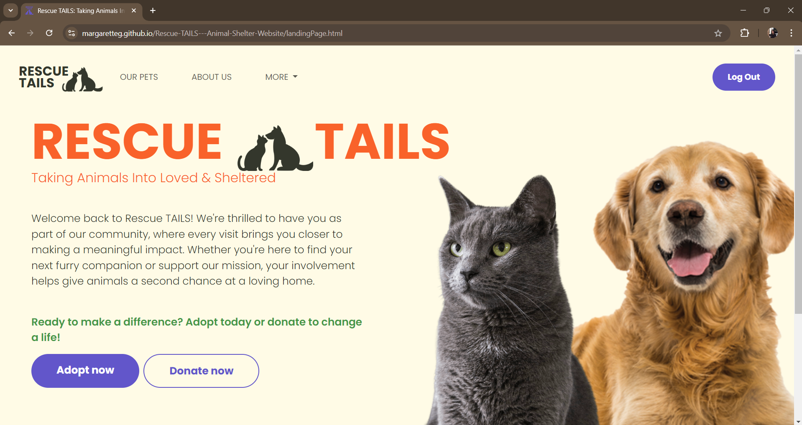
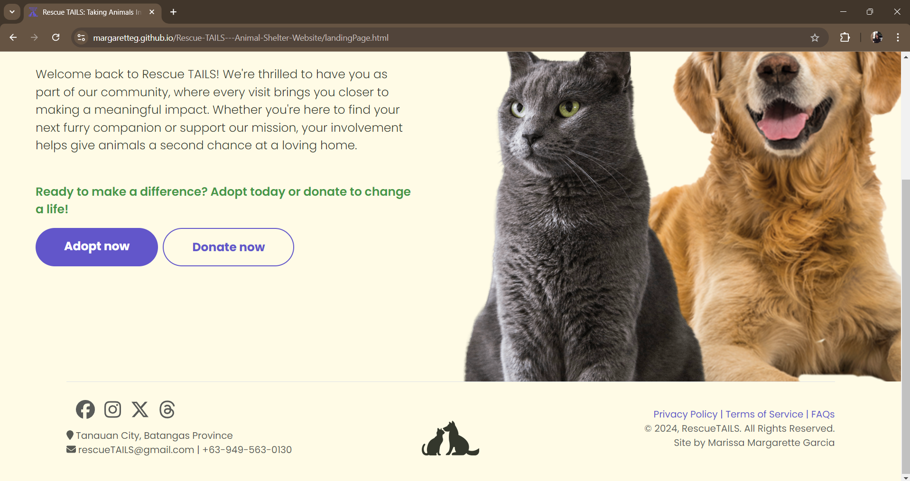

# RESCUE TAILS: Taking Animals Into Loved & Sheltered - Animal Shelter Website
# by Marissa Margarette Garcia
As part of our Midterm Examination for Web Systems and Technologies, this Front-end Web Application is responsive on all devices, every buttons and links are working, including footer's quick links, has a sign in and sign up page, and also a landing page.

Welcome to **RESCUE TAILS**, an animal shelter website that helps connect homeless pets with loving families. This website allows users to browse available pets, learn about the adoption process, and make donations to support our cause.

## How to Use
1. **Sign In**: Sign in to our site using the static data I provided.
   - Username: user@gmail.com
   - Password: user123
3. **Browse Pets**: Navigate to the "Adopt" page to view available pets.
4. **Adoption Process**: Follow our 3-step adoption process:
   - Visit the shelter.
   - Meet your future pet.
   - Take your new pet home.
5. **Donate**: Support us by making a donation through the "Donate" page.

## Some Screenshots of Rescue TAILS Website (navigate through the website to experience full full functions)

*The Welcoming Page of Rescue Tails.*

*The Sign Up Page of Rescue Tails.*

*The Sign In Page of Rescue Tails.*

*The Landing Page of Rescue Tails.*

*The Footer of Rescue Tails.*

